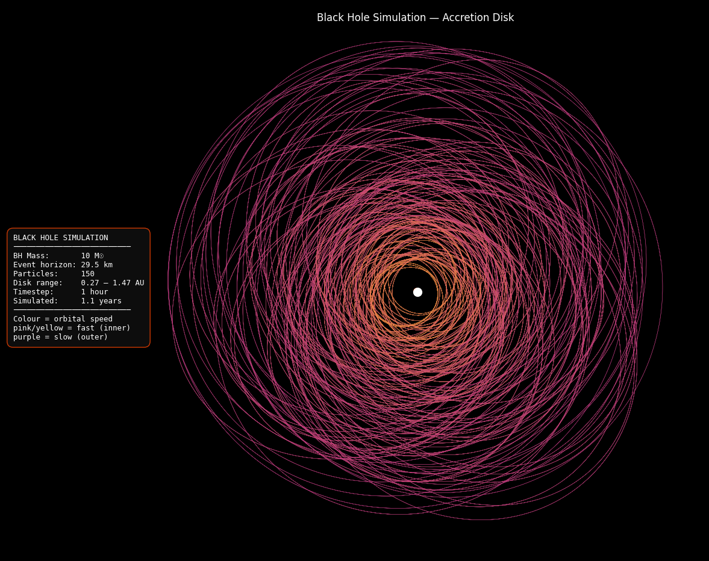

# Black Hole Simulation
 
A 2D gravitational physics simulation of an accretion disk around a stellar-mass black hole, built from scratch in Python in a single day.
 

 
---
 
## The Journey — How This Was Built
 
This project was built progressively, each phase adding new physics and complexity on top of the last.
 
### Phase 1 — The Foundation
Everything started with two core building blocks:
 
**A 2D vector class** to represent positions, velocities, and forces:
```python
class Vec2:
    def magnitude(self): return math.sqrt(self.x**2 + self.y**2)
    def normalized(self): ...  # unit vector — direction without magnitude
    def dot(self, other): ...  # dot product
```
 
**A Body class** representing any physical object with mass, position, and velocity:
```python
class Body:
    def apply_force(self, force: Vec2): ...
    def update(self, dt: float): ...     # Euler integration
```
 
And Newton's law of gravitation connecting them:
```
F = G · m₁ · m₂ / r²
```
 
The first result was a simple Sun-Earth orbit — a single planet tracing a circle around a central mass.
 
---
 
### Phase 2 — Better Physics (RK4 Integration)
The first integrator used was **Euler integration** — the simplest possible method:
```
next_pos = pos + vel × dt
next_vel = vel + acc × dt
```
The problem: Euler only samples the slope at the *start* of each timestep, causing orbits to slowly spiral outward and bleed energy over time.
 
The fix was **Runge-Kutta 4th order (RK4)** — a method that samples the slope at four points across each timestep and takes a weighted average:
```
final = (k1 + 2k2 + 2k3 + k4) / 6
```
The result: total mechanical energy stayed constant to 6 significant figures across 100,000 simulation steps (~11 simulated years). Energy conservation is the gold standard proof that a physics integrator is correct.
 
---
 
### Phase 3 — The Black Hole
The Sun was replaced with a stellar-mass black hole (10× solar mass). Two new physics concepts were introduced:
 
**Schwarzschild radius** — the radius of the event horizon, the point of no return:
```
rs = 2GM / c²
```
For a 10 solar-mass black hole: rs ≈ 29.5 km. Any object crossing this boundary cannot escape — escaping would require travelling faster than light.
 
**Event horizon capture detection** — every step, each particle's distance to the black hole is checked:
```python
if distance < schwarzschild_radius:
    particle captured
```
 
---
 
### Phase 4 — The Accretion Disk (Final Form)
The single orbiter was replaced with **150 particles** spawned in a ring between 0.27 and 1.47 AU, each given a randomized elliptical orbit:
 
```python
v_circular = sqrt(G · M / r)      # exact speed for circular orbit
speed = v_circular × random(0.70, 0.95)  # 70–95% → elliptical, spiraling inward
```
 
Each particle's trail is colored by its **average orbital speed** using matplotlib's plasma colormap:
```
slow (outer disk)  →  purple
medium             →  pink / magenta
fast (inner disk)  →  orange / yellow
```
 
This mirrors real accretion disk physics — inner material orbits faster, carries more kinetic energy, and radiates more heat.
 
---
 
## The Physics & Math
 
### Newton's Law of Gravitation
Every pair of masses attracts each other with force:
```
F = G · m₁ · m₂ / r²
```
- `G = 6.674 × 10⁻¹¹` m³ kg⁻¹ s⁻²
- Force direction always points from one body toward the other
- Magnitude falls off with the square of the distance
### RK4 Integration
At each timestep dt, instead of using the slope once (Euler), RK4 uses four estimates:
```
k1 = f(t,  y)               ← slope at start
k2 = f(t + dt/2, y + k1/2)  ← slope at midpoint using k1
k3 = f(t + dt/2, y + k2/2)  ← slope at midpoint using k2
k4 = f(t + dt,   y + k3)    ← slope at end
 
next = y + (dt/6)(k1 + 2k2 + 2k3 + k4)
```
Midpoints are weighted double because they're more representative of the step as a whole.
 
### Schwarzschild Radius
Derived from General Relativity — the radius at which escape velocity equals the speed of light:
```
rs = 2GM / c²
```
- Earth's Schwarzschild radius: ~9 mm
- Sun's Schwarzschild radius: ~3 km
- This simulation's black hole (10 M☉): ~29.5 km
### Orbital Mechanics
For a circular orbit, gravitational force equals centripetal force:
```
G·M·m / r² = m·v² / r
→  v = sqrt(G·M / r)
```
Particles given less than this speed follow elliptical orbits that dip closer to the black hole — the basis of the accretion disk spiral.
 
### Kepler's Third Law (emergent)
Inner particles orbit faster than outer ones — this emerges naturally from the gravity simulation and is why the inner disk glows brighter in the visualization.
 
---
 
## Final Result
 
- **150-particle accretion disk** around a 10 solar-mass black hole
- **1.1 simulated years** of orbital evolution
- **RK4 integration** with verified energy conservation
- **Speed-based color mapping** — plasma colormap from purple (slow) to orange/yellow (fast)
- **Physics info panel** showing all simulation parameters
---
 
## Project Structure
 
```
black-hole-simulation/
├── simulation.py   # Everything — physics engine, integrator, rendering
├── preview.png     # Output visualization
└── README.md
```
 
---
 
## How to Run
 
**Requirements:** Python 3.12+
 
```bash
pip install matplotlib numpy
py -3.12 simulation.py
```
 
The simulation will print energy readings to the terminal while running, then display the final plot.
 
**Tweak the parameters** at the bottom of `simulation.py`:
```python
BH_MASS  = 1.989e31   # black hole mass (kg) — try 1.989e32 for 100 solar masses
steps    = 10000      # simulation steps — more steps = denser trails
R_INNER  = 0.4e11     # inner disk edge (meters)
R_OUTER  = 2.2e11     # outer disk edge (meters)
```
 
---
 
## Built With
 
- Python 3.12
- matplotlib — plotting and visualization
- numpy — numerical arrays for color mapping
- math / random — standard library physics and randomization